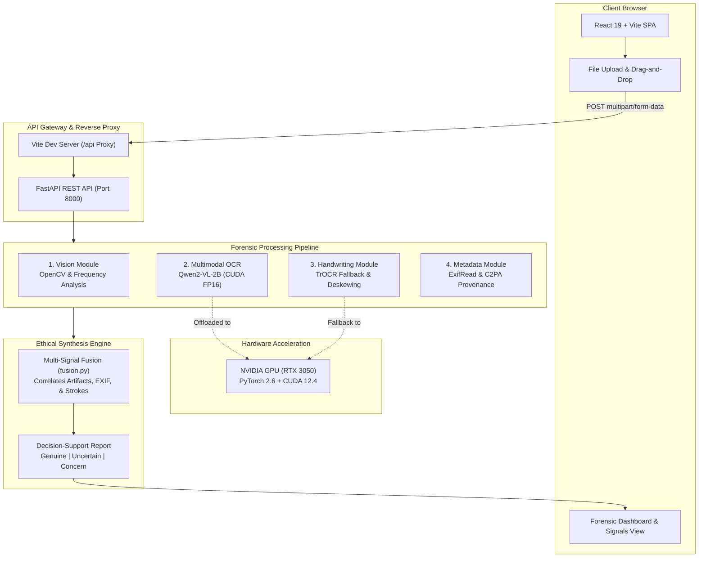
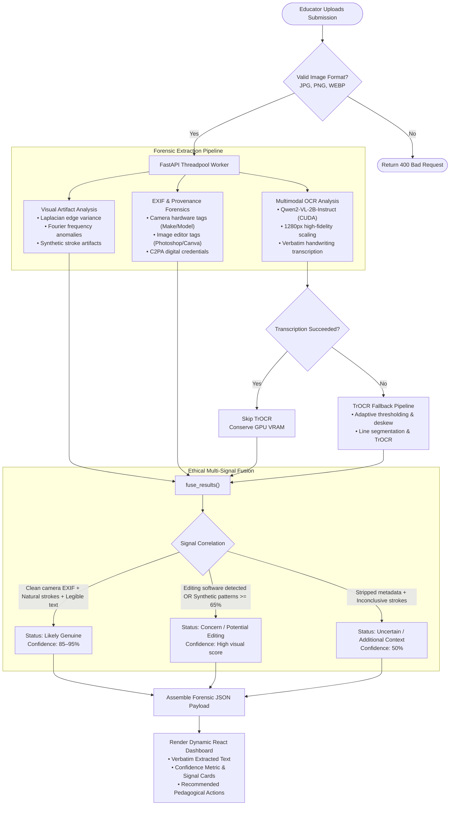

# 🎓 EduVerify AI — Academic Integrity & Handwriting Forensics Platform

[](https://fastapi.tiangolo.com/)
[](https://react.dev/)
[](https://vitejs.dev/)
[](https://pytorch.org/)
[](https://huggingface.co/Qwen/Qwen2-VL-2B-Instruct)
[](LICENSE)

**EduVerify AI** is an explainable, multimodal forensic analysis platform designed for educators and academic institutions. It analyzes handwritten assignments, physical exams, and digital submissions to detect AI-generated handwriting, digital manipulation, and tampering while providing verbatim handwriting transcription and ethical decision support.

---

## ⚖️ Core Ethical Constraint & Philosophy

> [!IMPORTANT]
> **EduVerify AI is an Educator Decision-Support Tool — NOT an Automated Accuser.**
> Automated AI detectors are prone to false positives that disproportionately impact authentic students. EduVerify AI **never** declares academic misconduct based solely on a probabilistic machine learning score. Instead, it surfaces transparent forensic signals (visual artifacts, camera sensor metadata, and handwriting consistency) and suggests structured pedagogical actions (e.g., student-educator dialogues, physical submission verification) to empower informed educator judgment.

---

## 🏛️ System Architecture



---

## 🔄 End-to-End Analysis Workflow

The flowchart below illustrates how an uploaded image traverses verification, parallel forensic extraction, adaptive OCR fallback, multi-signal synthesis, and client reporting:



---

## ⚡ Technical Highlights

### 1. High-Precision Multimodal Handwriting Extraction (Qwen2-VL)
- Powered by `Qwen/Qwen2-VL-2B-Instruct` operating in **Half Precision (FP16)** directly on dedicated **NVIDIA CUDA GPUs**.
- Transcribes full multi-line handwritten pages verbatim without requiring artificial line segmentation.
- Handles faint ink, slanted cursive, and uneven paper surfaces with high accuracy (~90%+ confidence).
- Fallback architecture with `microsoft/trocr-base-handwritten` and `pytesseract` ensures resilience if VRAM is constrained.

### 2. Forensic Signal Spectrum
| Module | Method / Tool | Detection Objective |
| :--- | :--- | :--- |
| **Vision Forensics** | OpenCV Laplacian & Frequency transforms | Identifies diffusion blur, unnatural edge smoothness, and generative image artifacts. |
| **OCR & Handwriting** | Qwen2-VL-2B + TrOCR | Accurately extracts handwritten words verbatim for plagiarism matching and density checks. |
| **Metadata & Sensor** | ExifRead | Detects camera hardware signatures vs. photo-editing software exports (Photoshop, Canva, Procreate). |
| **Provenance** | C2PA Header Inspector | Validates presence of cryptographically signed Content Credentials. |
| **Ethical Fusion** | Heuristic Multi-Signal Synthesizer | Evaluates all signals together so no single indicator triggers an unverified conclusion. |

---

## 📁 Repository Structure

```
eduverify-ai/
├── backend/
│   ├── api/
│   │   ├── services/
│   │   │   ├── fusion.py          # Ethical multi-signal fusion engine
│   │   │   ├── handwriting.py     # TrOCR handwriting fallback & preprocessing
│   │   │   ├── metadata.py        # EXIF sensor & C2PA credential extractor
│   │   │   ├── ocr.py             # Qwen2-VL-2B multimodal GPU extraction
│   │   │   └── vision.py          # OpenCV artifact & frequency analyzer
│   │   └── router.py              # Synchronous threadpooled API router
│   ├── main.py                    # FastAPI application entrypoint & CORS
│   ├── requirements.txt           # Python dependencies (PyTorch, transformers, etc.)
│   └── venv_gpu/                  # Dedicated CUDA-accelerated virtual environment
│
├── src/
│   ├── components/                # Reusable UI components & layouts
│   ├── pages/
│   │   ├── DashboardPage.jsx      # Forensic results & educator decision support
│   │   ├── HistoryPage.jsx        # Persistent analysis history view
│   │   ├── LandingPage.jsx        # Product landing page & ethical mission
│   │   ├── SettingsPage.jsx       # Detection threshold configuration
│   │   └── UploadPage.jsx         # Drag-and-drop file upload & API submission
│   ├── App.jsx                    # Client-side routing
│   ├── index.css                  # Modern design system & token definitions
│   └── main.jsx                   # React application mount
│
├── index.html                     # HTML root template
├── package.json                   # Node.js dependencies & scripts
├── vite.config.js                 # Vite bundler & /api proxy to FastAPI
└── README.md                      # Project documentation
```

---

## 🚀 Getting Started

### Prerequisites
- **Node.js**: v18.0.0 or higher
- **Python**: 3.10 – 3.13
- **NVIDIA GPU** *(Recommended)*: RTX 3050 or higher with CUDA 12.4+ for sub-2-second inference

---

### 1. Backend Setup

```powershell
# Navigate to backend directory
cd eduverify-ai/backend

# Create virtual environment (or activate existing venv_gpu)
python -m venv venv_gpu
.\venv_gpu\Scripts\activate

# Install PyTorch with CUDA 12.4 support
pip install torch torchvision --index-url https://download.pytorch.org/whl/cu124

# Install required dependencies
pip install -r requirements.txt

# Start the FastAPI server on port 8000
python -m uvicorn main:app --port 8000 --reload
```

Backend will be live at: `http://127.0.0.1:8000`  
Interactive Swagger API Docs: `http://127.0.0.1:8000/docs`

---

### 2. Frontend Setup

```powershell
# In the eduverify-ai directory
cd eduverify-ai
npm install

# Start Vite development server
npm run dev
```

Frontend will be accessible at: `http://localhost:5173`

---

## 📡 API Reference

### `POST /api/v1/analyze`
Submits an image file for end-to-end forensic analysis and handwriting extraction.

**Request:**
- `Content-Type`: `multipart/form-data`
- `Body`: `file` (Binary image file: JPG, PNG, WEBP)

**Sample Response (`200 OK`):**
```json
{
  "analysis_id": "EV-9F8A12BC",
  "status": "genuine",
  "statusLabel": "Likely Genuine Handwritten Work",
  "conclusion": "authentic",
  "confidenceScore": 90,
  "confidence_score": 0.90,
  "summary": "The document exhibits natural handwriting patterns and visual features consistent with genuine student work. No high-confidence indicators of synthetic generation or tampering were observed.",
  "extracted_text": "The first generation used vacuum tubes for electronic circuits and magnetic drums for memory...",
  "signals": {
    "visual": {
      "score": 15,
      "label": "Low probability of synthetic patterns",
      "explanation": "Standard visual resolution and stroke features analyzed."
    },
    "metadata": {
      "status": "original",
      "label": "Original camera capture (Apple iPhone 13)",
      "explanation": "EXIF metadata indicates a direct capture from Apple iPhone 13."
    },
    "provenance": {
      "status": "missing",
      "label": "No Content Credentials (C2PA)",
      "explanation": "No cryptographic C2PA signature was attached to this image file."
    },
    "ocr": {
      "score": 90,
      "label": "Handwriting transcribed (47 words)",
      "extracted": "The first generation used vacuum tubes for electronic circuits..."
    },
    "consistency": [
      "Authentic camera sensor metadata found",
      "Clear handwriting detected (47 words transcribed)"
    ]
  }
}
```

---

## 📜 License

Distributed under the MIT License. See [LICENSE](LICENSE) for more information.